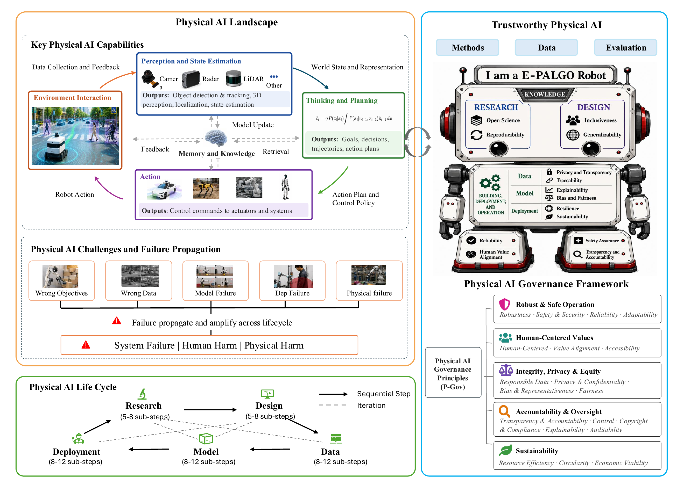
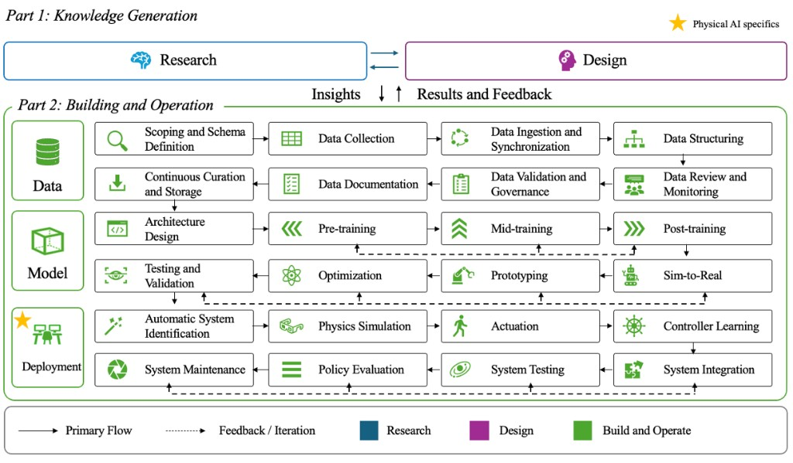

# Towards Trustworthy Physical AI: From Theory to Practice across Life Cycle

This repository hosts the main survey paper **"Towards Trustworthy Physical AI: From Theory to Practice across Life Cycle."**

- **Paper (PDF):** [`Towards_Trustworthy_Physical_AI.pdf`](./Towards_Trustworthy_Physical_AI.pdf) (51 pages, latest)
- **SSRN:** https://ssrn.com/abstract=7172338
- **DOI:** [10.2139/ssrn.7172338](http://dx.doi.org/10.2139/ssrn.7172338)
- **Posted:** 5 Aug 2026 · **Last revised:** 20 Aug 2026

## Download

- **Latest version:** [`Towards_Trustworthy_Physical_AI.pdf`](./Towards_Trustworthy_Physical_AI.pdf)
- **V2 — 9 Aug 2026:** [`versions/v2_2026-08-09.pdf`](./versions/v2_2026-08-09.pdf)
- **V1 — 24 Jul 2026:** [`versions/v1_2026-07-24.pdf`](./versions/v1_2026-07-24.pdf)

> Tip: to download a PDF, open the link and use the download button, or right-click the link and choose "Save link as…".

## Abstract

Physical AI refers to AI systems that are grounded in the physical world through physical perception, physical reasoning, modelling, prediction, simulation, planning, or embodied interaction. Unlike conventional AI systems, Physical AI operates under real-time safety constraints and interacts continuously with uncertain environments. As existing Trustworthy AI frameworks have been developed primarily for digital AI systems, they do not fully capture the distinctive challenges of Physical AI, such as physical safety, cyber-physical security, and material circularity. To address this gap, we present a comprehensive survey of trustworthy Physical AI principles. First, we systematically characterize the Physical AI landscape, encompassing its core capabilities and emerging challenges. Second, we examine the end-to-end Physical AI life cycle with five core stages and introduce T-PAIO to address trustworthiness considerations in practice with experiment process and results. Third, we develop T-PAI, a comprehensive theoretical framework for Physical AI trustworthiness that organizes key principles into a systematic guide.

**Keywords:** Physical AI Life Cycle, Physical AI Governance, Trustworthy Embodied AI

## Figures

### Physical AI Overview



*Source: [`figures/physical_ai_overview.pdf`](./figures/physical_ai_overview.pdf)*

### Physical AI Life Cycle



## How We Work

- **Monthly updates:** We update our paper on the **first Monday of every month**.
- **Authorship:** Everyone who contributes in the Overleaf project will be named as an author. To join, please let us know by emailing **[trustworthyphysicalai@gmail.com](mailto:trustworthyphysicalai@gmail.com)**.
- **Community principle:** This work is for the healthy and safe development of technology, with **no intention to slow down the development of good technology**.
- **Independent research:** This is an independent research work with collaborators around the world.
- **Open to feedback:** We welcome questions, critiques, and ideas, and we would like to improve this work in all forms. If you would like to communicate, please write to **[trustworthyphysicalai@gmail.com](mailto:trustworthyphysicalai@gmail.com)**.

## Success Criteria

We hold this paper to the following bar. These are the standards we use to judge whether a section is ready and whether a contribution strengthens the work.

- **It should read like a reference book.** Guidance should be prescriptive and actionable: *"if A, B, and C happen, use X, Y, and Z"* — with evidence from this paper or the prior literature demonstrating that X, Y, and Z actually work.
- **It should give net-new insight.** Rather than restating each source in turn, we connect results across papers, find commonalities, and surface mechanisms that the individual papers do not state on their own.
- **It should be specific.** Solutions are tied to particular applications and settings, not left at the level of general principle.

## Citation

```bibtex
@article{yang2026trustworthyphysicalai,
  title   = {Towards Trustworthy Physical AI: From Theory to Practice across Life Cycle},
  author  = {Yang, Van and Wang, Shaobo and Liu, Hongxuan and Cai, Xiaoran and He, Yunyu and Zhou, Jingzong and Ma, Mengzhong and Yu, Yi and Sharma, Rohit and Fu, Jingjing and Qi, Peng},
  year    = {2026},
  note    = {SSRN Working Paper},
  doi     = {10.2139/ssrn.7172338},
  url     = {https://ssrn.com/abstract=7172338}
}
```

## License

The copyright holder has granted SSRN a license. All rights reserved. No reuse allowed without permission.
